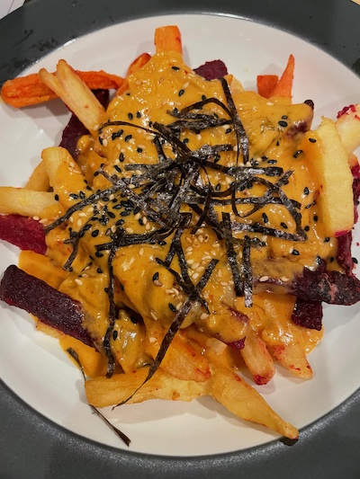

# Kimchi Cheese sauce

Put it on fries, cheesesteaks, burgers, chips, but not your cat.

## Ingredients 

- 8oz corsely grated cheese (cheddar and/or gruyère)
- 1/4 cup evaporated milk
- 1/2 cup kimchi (the funkier, the better) and juice
- 1 tablespoon gochugaru (red pepper flake)
- 1 tablespoon gochujang (fermented red pepper paste)
- 1/2 teaspoon cornstarch

## Directions

Toss cheese with cornstarch and add to nonstick skillet, place over medium-low heat.

Add evaporated milk a tablespoon at a time, and stir frequently until melted and runny.

In another skillet, fry the drained kimchi in a tablespoon of oil. 

Add the fried kimchi, reserved liquid, gochugaru, and gochujang.

Add evaporated milk as needed to retain a runny consistency. 

You can also throw in a slice of american cheese to help with the texture if needed, or when reheating.

Spoon over fries, tots, burgers, etc. Garnish with sesame seeds and chopped seaweed.

# Notes

The cheese sauce technique is from [Brian Lagerstrom's cheesesteak recipe](https://youtu.be/VtLzdBQh4WE). 

ECH, 22 Dec 2021
